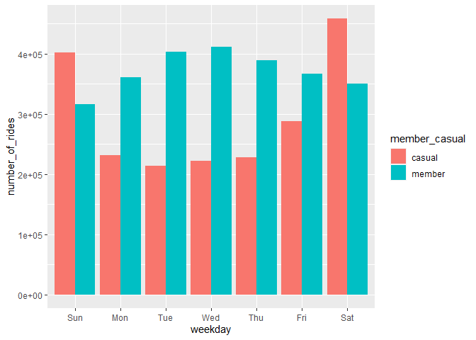
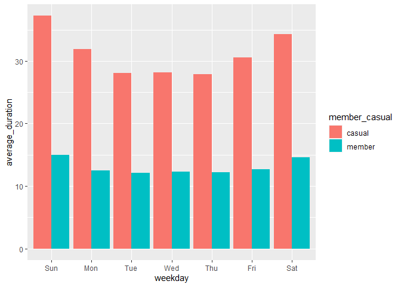

Cyclistic bike-share analysis case study
================
Amara Igboanugo
20th June 2022

``` r
knitr::opts_chunk$set(echo = TRUE)
```

#### Introduction

**Cyclistic** is a fictional **bike-sharing company** that features more
than 5,800 bicycles and 600 docking stations.

The **business task** is to understand better how **annual members** at
Cyclistic differ from **casual members** of Cyclistic, in order to
design marketing strategies aimed at converting casual riders into
annual members.

#### Data source

Data source is public data made available by Motivate International Inc,
with a license to use Lyft Bikes and Scooters, LLC (“Bikeshare”) Divvy
bicycle sharing data.

The datasets provide data that can be used to explore how different
customer types are using Cyclistic bikes. 12 datasets were used, each
being a monthly collection of data gathered from activities of Cyclistic
riders.

##### Load packages

``` r
getwd()
```

    ## [1] "C:/Users/Amara/Documents/Bike-Trips-main/Bike-Share"

``` r
library(tidyverse)
```

    ## Warning: package 'tidyverse' was built under R version 4.1.3

    ## -- Attaching packages --------------------------------------- tidyverse 1.3.1 --

    ## v ggplot2 3.3.5     v purrr   0.3.4
    ## v tibble  3.1.6     v dplyr   1.0.8
    ## v tidyr   1.1.4     v stringr 1.4.0
    ## v readr   2.1.1     v forcats 0.5.1

    ## Warning: package 'dplyr' was built under R version 4.1.3

    ## -- Conflicts ------------------------------------------ tidyverse_conflicts() --
    ## x dplyr::filter() masks stats::filter()
    ## x dplyr::lag()    masks stats::lag()

#### Import csv files

``` r
april_2021 <- read_csv("Case study CSV/202104-divvy-tripdata.csv")
```

    ## Rows: 337230 Columns: 13
    ## -- Column specification --------------------------------------------------------
    ## Delimiter: ","
    ## chr  (7): ride_id, rideable_type, start_station_name, start_station_id, end_...
    ## dbl  (4): start_lat, start_lng, end_lat, end_lng
    ## dttm (2): started_at, ended_at
    ## 
    ## i Use `spec()` to retrieve the full column specification for this data.
    ## i Specify the column types or set `show_col_types = FALSE` to quiet this message.

``` r
may_2021 <- read_csv("Case study CSV/202105-divvy-tripdata.csv")
```

    ## Rows: 531633 Columns: 13
    ## -- Column specification --------------------------------------------------------
    ## Delimiter: ","
    ## chr  (7): ride_id, rideable_type, start_station_name, start_station_id, end_...
    ## dbl  (4): start_lat, start_lng, end_lat, end_lng
    ## dttm (2): started_at, ended_at
    ## 
    ## i Use `spec()` to retrieve the full column specification for this data.
    ## i Specify the column types or set `show_col_types = FALSE` to quiet this message.

``` r
june_2021 <- read_csv("Case study CSV/202106-divvy-tripdata.csv")
```

    ## Rows: 729595 Columns: 13
    ## -- Column specification --------------------------------------------------------
    ## Delimiter: ","
    ## chr  (7): ride_id, rideable_type, start_station_name, start_station_id, end_...
    ## dbl  (4): start_lat, start_lng, end_lat, end_lng
    ## dttm (2): started_at, ended_at
    ## 
    ## i Use `spec()` to retrieve the full column specification for this data.
    ## i Specify the column types or set `show_col_types = FALSE` to quiet this message.

``` r
july_2021 <- read_csv("Case study CSV/202107-divvy-tripdata.csv")
```

    ## Rows: 822410 Columns: 13
    ## -- Column specification --------------------------------------------------------
    ## Delimiter: ","
    ## chr  (7): ride_id, rideable_type, start_station_name, start_station_id, end_...
    ## dbl  (4): start_lat, start_lng, end_lat, end_lng
    ## dttm (2): started_at, ended_at
    ## 
    ## i Use `spec()` to retrieve the full column specification for this data.
    ## i Specify the column types or set `show_col_types = FALSE` to quiet this message.

``` r
aug_2021 <- read_csv("Case study CSV/202108-divvy-tripdata.csv")
```

    ## Rows: 804352 Columns: 13
    ## -- Column specification --------------------------------------------------------
    ## Delimiter: ","
    ## chr  (7): ride_id, rideable_type, start_station_name, start_station_id, end_...
    ## dbl  (4): start_lat, start_lng, end_lat, end_lng
    ## dttm (2): started_at, ended_at
    ## 
    ## i Use `spec()` to retrieve the full column specification for this data.
    ## i Specify the column types or set `show_col_types = FALSE` to quiet this message.

``` r
sept_2021 <- read_csv("Case study CSV/202109-divvy-tripdata.csv")
```

    ## Rows: 756147 Columns: 13
    ## -- Column specification --------------------------------------------------------
    ## Delimiter: ","
    ## chr  (7): ride_id, rideable_type, start_station_name, start_station_id, end_...
    ## dbl  (4): start_lat, start_lng, end_lat, end_lng
    ## dttm (2): started_at, ended_at
    ## 
    ## i Use `spec()` to retrieve the full column specification for this data.
    ## i Specify the column types or set `show_col_types = FALSE` to quiet this message.

``` r
oct_2021 <- read_csv("Case study CSV/202110-divvy-tripdata.csv")
```

    ## Rows: 631226 Columns: 13
    ## -- Column specification --------------------------------------------------------
    ## Delimiter: ","
    ## chr  (7): ride_id, rideable_type, start_station_name, start_station_id, end_...
    ## dbl  (4): start_lat, start_lng, end_lat, end_lng
    ## dttm (2): started_at, ended_at
    ## 
    ## i Use `spec()` to retrieve the full column specification for this data.
    ## i Specify the column types or set `show_col_types = FALSE` to quiet this message.

``` r
nov_2021 <- read_csv("Case study CSV/202111-divvy-tripdata.csv")
```

    ## Rows: 359978 Columns: 13
    ## -- Column specification --------------------------------------------------------
    ## Delimiter: ","
    ## chr  (7): ride_id, rideable_type, start_station_name, start_station_id, end_...
    ## dbl  (4): start_lat, start_lng, end_lat, end_lng
    ## dttm (2): started_at, ended_at
    ## 
    ## i Use `spec()` to retrieve the full column specification for this data.
    ## i Specify the column types or set `show_col_types = FALSE` to quiet this message.

``` r
dec_2021 <- read_csv("Case study CSV/202112-divvy-tripdata.csv")
```

    ## Rows: 247540 Columns: 13
    ## -- Column specification --------------------------------------------------------
    ## Delimiter: ","
    ## chr  (7): ride_id, rideable_type, start_station_name, start_station_id, end_...
    ## dbl  (4): start_lat, start_lng, end_lat, end_lng
    ## dttm (2): started_at, ended_at
    ## 
    ## i Use `spec()` to retrieve the full column specification for this data.
    ## i Specify the column types or set `show_col_types = FALSE` to quiet this message.

``` r
jan_2022 <- read_csv("Case study CSV/202201-divvy-tripdata.csv")
```

    ## Rows: 103770 Columns: 13
    ## -- Column specification --------------------------------------------------------
    ## Delimiter: ","
    ## chr  (7): ride_id, rideable_type, start_station_name, start_station_id, end_...
    ## dbl  (4): start_lat, start_lng, end_lat, end_lng
    ## dttm (2): started_at, ended_at
    ## 
    ## i Use `spec()` to retrieve the full column specification for this data.
    ## i Specify the column types or set `show_col_types = FALSE` to quiet this message.

``` r
feb_2022 <- read_csv("Case study CSV/202202-divvy-tripdata.csv")
```

    ## Rows: 115609 Columns: 13
    ## -- Column specification --------------------------------------------------------
    ## Delimiter: ","
    ## chr  (7): ride_id, rideable_type, start_station_name, start_station_id, end_...
    ## dbl  (4): start_lat, start_lng, end_lat, end_lng
    ## dttm (2): started_at, ended_at
    ## 
    ## i Use `spec()` to retrieve the full column specification for this data.
    ## i Specify the column types or set `show_col_types = FALSE` to quiet this message.

``` r
march_2022 <- read_csv("Case study CSV/202203-divvy-tripdata.csv")
```

    ## Rows: 284042 Columns: 13
    ## -- Column specification --------------------------------------------------------
    ## Delimiter: ","
    ## chr  (7): ride_id, rideable_type, start_station_name, start_station_id, end_...
    ## dbl  (4): start_lat, start_lng, end_lat, end_lng
    ## dttm (2): started_at, ended_at
    ## 
    ## i Use `spec()` to retrieve the full column specification for this data.
    ## i Specify the column types or set `show_col_types = FALSE` to quiet this message.

#### Data frame summaries

``` r
head(april_2021)
```

    ## # A tibble: 6 x 13
    ##   ride_id rideable_type started_at          ended_at            start_station_n~
    ##   <chr>   <chr>         <dttm>              <dttm>              <chr>           
    ## 1 6C992B~ classic_bike  2021-04-12 18:25:36 2021-04-12 18:56:55 State St & Pear~
    ## 2 1E0145~ docked_bike   2021-04-27 17:27:11 2021-04-27 18:31:29 Dorchester Ave ~
    ## 3 E498E1~ docked_bike   2021-04-03 12:42:45 2021-04-07 11:40:24 Loomis Blvd & 8~
    ## 4 188726~ classic_bike  2021-04-17 09:17:42 2021-04-17 09:42:48 Honore St & Div~
    ## 5 C12354~ docked_bike   2021-04-03 12:42:25 2021-04-03 14:13:42 Loomis Blvd & 8~
    ## 6 097E76~ classic_bike  2021-04-25 18:43:18 2021-04-25 18:43:59 Clinton St & Po~
    ## # ... with 8 more variables: start_station_id <chr>, end_station_name <chr>,
    ## #   end_station_id <chr>, start_lat <dbl>, start_lng <dbl>, end_lat <dbl>,
    ## #   end_lng <dbl>, member_casual <chr>

``` r
head(may_2021)
```

    ## # A tibble: 6 x 13
    ##   ride_id rideable_type started_at          ended_at            start_station_n~
    ##   <chr>   <chr>         <dttm>              <dttm>              <chr>           
    ## 1 C809ED~ electric_bike 2021-05-30 11:58:15 2021-05-30 12:10:39 <NA>            
    ## 2 DD59FD~ electric_bike 2021-05-30 11:29:14 2021-05-30 12:14:09 <NA>            
    ## 3 0AB83C~ electric_bike 2021-05-30 14:24:01 2021-05-30 14:25:13 <NA>            
    ## 4 7881AC~ electric_bike 2021-05-30 14:25:51 2021-05-30 14:41:04 <NA>            
    ## 5 853FA7~ electric_bike 2021-05-30 18:15:39 2021-05-30 18:22:32 <NA>            
    ## 6 F5E63D~ electric_bike 2021-05-30 11:33:41 2021-05-30 11:57:17 <NA>            
    ## # ... with 8 more variables: start_station_id <chr>, end_station_name <chr>,
    ## #   end_station_id <chr>, start_lat <dbl>, start_lng <dbl>, end_lat <dbl>,
    ## #   end_lng <dbl>, member_casual <chr>

``` r
head(june_2021)
```

    ## # A tibble: 6 x 13
    ##   ride_id rideable_type started_at          ended_at            start_station_n~
    ##   <chr>   <chr>         <dttm>              <dttm>              <chr>           
    ## 1 99FEC9~ electric_bike 2021-06-13 14:31:28 2021-06-13 14:34:11 <NA>            
    ## 2 06048D~ electric_bike 2021-06-04 11:18:02 2021-06-04 11:24:19 <NA>            
    ## 3 959806~ electric_bike 2021-06-04 09:49:35 2021-06-04 09:55:34 <NA>            
    ## 4 B03C0F~ electric_bike 2021-06-03 19:56:05 2021-06-03 20:21:55 <NA>            
    ## 5 B9EEA8~ electric_bike 2021-06-04 14:05:51 2021-06-04 14:09:59 <NA>            
    ## 6 62B943~ electric_bike 2021-06-03 19:32:01 2021-06-03 19:38:46 <NA>            
    ## # ... with 8 more variables: start_station_id <chr>, end_station_name <chr>,
    ## #   end_station_id <chr>, start_lat <dbl>, start_lng <dbl>, end_lat <dbl>,
    ## #   end_lng <dbl>, member_casual <chr>

``` r
head(july_2021)
```

    ## # A tibble: 6 x 13
    ##   ride_id rideable_type started_at          ended_at            start_station_n~
    ##   <chr>   <chr>         <dttm>              <dttm>              <chr>           
    ## 1 0A1B62~ docked_bike   2021-07-02 14:44:36 2021-07-02 15:19:58 Michigan Ave & ~
    ## 2 B2D558~ classic_bike  2021-07-07 16:57:42 2021-07-07 17:16:09 California Ave ~
    ## 3 6F2645~ classic_bike  2021-07-25 11:30:55 2021-07-25 11:48:45 Wabash Ave & 16~
    ## 4 379B58~ classic_bike  2021-07-08 22:08:30 2021-07-08 22:23:32 California Ave ~
    ## 5 6615C1~ electric_bike 2021-07-28 16:08:06 2021-07-28 16:27:09 California Ave ~
    ## 6 62DC2B~ electric_bike 2021-07-29 17:09:08 2021-07-29 17:15:00 California Ave ~
    ## # ... with 8 more variables: start_station_id <chr>, end_station_name <chr>,
    ## #   end_station_id <chr>, start_lat <dbl>, start_lng <dbl>, end_lat <dbl>,
    ## #   end_lng <dbl>, member_casual <chr>

``` r
head(aug_2021)
```

    ## # A tibble: 6 x 13
    ##   ride_id rideable_type started_at          ended_at            start_station_n~
    ##   <chr>   <chr>         <dttm>              <dttm>              <chr>           
    ## 1 99103B~ electric_bike 2021-08-10 17:15:49 2021-08-10 17:22:44 <NA>            
    ## 2 EAFCCC~ electric_bike 2021-08-10 17:23:14 2021-08-10 17:39:24 <NA>            
    ## 3 9EF4F4~ electric_bike 2021-08-21 02:34:23 2021-08-21 02:50:36 <NA>            
    ## 4 5834D3~ electric_bike 2021-08-21 06:52:55 2021-08-21 07:08:13 <NA>            
    ## 5 CD825C~ electric_bike 2021-08-19 11:55:29 2021-08-19 12:04:11 <NA>            
    ## 6 612F12~ electric_bike 2021-08-19 12:41:12 2021-08-19 12:47:47 <NA>            
    ## # ... with 8 more variables: start_station_id <chr>, end_station_name <chr>,
    ## #   end_station_id <chr>, start_lat <dbl>, start_lng <dbl>, end_lat <dbl>,
    ## #   end_lng <dbl>, member_casual <chr>

``` r
head(sept_2021)
```

    ## # A tibble: 6 x 13
    ##   ride_id rideable_type started_at          ended_at            start_station_n~
    ##   <chr>   <chr>         <dttm>              <dttm>              <chr>           
    ## 1 9DC7B9~ electric_bike 2021-09-28 16:07:10 2021-09-28 16:09:54 <NA>            
    ## 2 F930E2~ electric_bike 2021-09-28 14:24:51 2021-09-28 14:40:05 <NA>            
    ## 3 6EF721~ electric_bike 2021-09-28 00:20:16 2021-09-28 00:23:57 <NA>            
    ## 4 78D1DE~ electric_bike 2021-09-28 14:51:17 2021-09-28 15:00:06 <NA>            
    ## 5 E03D4A~ electric_bike 2021-09-28 09:53:12 2021-09-28 10:03:44 <NA>            
    ## 6 346DE3~ electric_bike 2021-09-28 01:53:18 2021-09-28 02:00:02 <NA>            
    ## # ... with 8 more variables: start_station_id <chr>, end_station_name <chr>,
    ## #   end_station_id <chr>, start_lat <dbl>, start_lng <dbl>, end_lat <dbl>,
    ## #   end_lng <dbl>, member_casual <chr>

``` r
head(oct_2021)
```

    ## # A tibble: 6 x 13
    ##   ride_id rideable_type started_at          ended_at            start_station_n~
    ##   <chr>   <chr>         <dttm>              <dttm>              <chr>           
    ## 1 620BC6~ electric_bike 2021-10-22 12:46:42 2021-10-22 12:49:50 Kingsbury St & ~
    ## 2 4471C7~ electric_bike 2021-10-21 09:12:37 2021-10-21 09:14:14 <NA>            
    ## 3 26CA69~ electric_bike 2021-10-16 16:28:39 2021-10-16 16:36:26 <NA>            
    ## 4 362947~ electric_bike 2021-10-16 16:17:48 2021-10-16 16:19:03 <NA>            
    ## 5 BB731D~ electric_bike 2021-10-20 23:17:54 2021-10-20 23:26:10 <NA>            
    ## 6 717630~ electric_bike 2021-10-21 16:57:37 2021-10-21 17:11:58 <NA>            
    ## # ... with 8 more variables: start_station_id <chr>, end_station_name <chr>,
    ## #   end_station_id <chr>, start_lat <dbl>, start_lng <dbl>, end_lat <dbl>,
    ## #   end_lng <dbl>, member_casual <chr>

``` r
head(nov_2021)
```

    ## # A tibble: 6 x 13
    ##   ride_id rideable_type started_at          ended_at            start_station_n~
    ##   <chr>   <chr>         <dttm>              <dttm>              <chr>           
    ## 1 7C00A9~ electric_bike 2021-11-27 13:27:38 2021-11-27 13:46:38 <NA>            
    ## 2 908548~ electric_bike 2021-11-27 13:38:25 2021-11-27 13:56:10 <NA>            
    ## 3 0A7D10~ electric_bike 2021-11-26 22:03:34 2021-11-26 22:05:56 <NA>            
    ## 4 2F3BE3~ electric_bike 2021-11-27 09:56:49 2021-11-27 10:01:50 <NA>            
    ## 5 D67B47~ electric_bike 2021-11-26 19:09:28 2021-11-26 19:30:41 <NA>            
    ## 6 02F85C~ electric_bike 2021-11-26 18:34:07 2021-11-26 18:52:49 Michigan Ave & ~
    ## # ... with 8 more variables: start_station_id <chr>, end_station_name <chr>,
    ## #   end_station_id <chr>, start_lat <dbl>, start_lng <dbl>, end_lat <dbl>,
    ## #   end_lng <dbl>, member_casual <chr>

``` r
head(dec_2021)
```

    ## # A tibble: 6 x 13
    ##   ride_id rideable_type started_at          ended_at            start_station_n~
    ##   <chr>   <chr>         <dttm>              <dttm>              <chr>           
    ## 1 46F816~ electric_bike 2021-12-07 15:06:07 2021-12-07 15:13:42 Laflin St & Cul~
    ## 2 73A777~ electric_bike 2021-12-11 03:43:29 2021-12-11 04:10:23 LaSalle Dr & Hu~
    ## 3 4CF424~ electric_bike 2021-12-15 23:10:28 2021-12-15 23:23:14 Halsted St & No~
    ## 4 3278BA~ classic_bike  2021-12-26 16:16:10 2021-12-26 16:30:53 Halsted St & No~
    ## 5 6FF542~ electric_bike 2021-12-30 11:31:05 2021-12-30 11:51:21 Leavitt St & Ch~
    ## 6 93E8D7~ classic_bike  2021-12-01 18:28:36 2021-12-01 18:38:03 Wabash Ave & 16~
    ## # ... with 8 more variables: start_station_id <chr>, end_station_name <chr>,
    ## #   end_station_id <chr>, start_lat <dbl>, start_lng <dbl>, end_lat <dbl>,
    ## #   end_lng <dbl>, member_casual <chr>

``` r
head(jan_2022)
```

    ## # A tibble: 6 x 13
    ##   ride_id rideable_type started_at          ended_at            start_station_n~
    ##   <chr>   <chr>         <dttm>              <dttm>              <chr>           
    ## 1 C2F7DD~ electric_bike 2022-01-13 11:59:47 2022-01-13 12:02:44 Glenwood Ave & ~
    ## 2 A6CF89~ electric_bike 2022-01-10 08:41:56 2022-01-10 08:46:17 Glenwood Ave & ~
    ## 3 BD0F91~ classic_bike  2022-01-25 04:53:40 2022-01-25 04:58:01 Sheffield Ave &~
    ## 4 CBB80E~ classic_bike  2022-01-04 00:18:04 2022-01-04 00:33:00 Clark St & Bryn~
    ## 5 DDC963~ classic_bike  2022-01-20 01:31:10 2022-01-20 01:37:12 Michigan Ave & ~
    ## 6 A39C6F~ classic_bike  2022-01-11 18:48:09 2022-01-11 18:51:31 Wood St & Chica~
    ## # ... with 8 more variables: start_station_id <chr>, end_station_name <chr>,
    ## #   end_station_id <chr>, start_lat <dbl>, start_lng <dbl>, end_lat <dbl>,
    ## #   end_lng <dbl>, member_casual <chr>

``` r
head(feb_2022)
```

    ## # A tibble: 6 x 13
    ##   ride_id rideable_type started_at          ended_at            start_station_n~
    ##   <chr>   <chr>         <dttm>              <dttm>              <chr>           
    ## 1 E1E065~ classic_bike  2022-02-19 18:08:41 2022-02-19 18:23:56 State St & Rand~
    ## 2 1602DC~ classic_bike  2022-02-20 17:41:30 2022-02-20 17:45:56 Halsted St & Wr~
    ## 3 BE7DD2~ classic_bike  2022-02-25 18:55:56 2022-02-25 19:09:34 State St & Rand~
    ## 4 A1789B~ classic_bike  2022-02-14 11:57:03 2022-02-14 12:04:00 Southport Ave &~
    ## 5 07DE78~ classic_bike  2022-02-16 05:36:06 2022-02-16 05:39:00 State St & Rand~
    ## 6 9A2F20~ classic_bike  2022-02-07 09:51:57 2022-02-07 10:07:53 St. Clair St & ~
    ## # ... with 8 more variables: start_station_id <chr>, end_station_name <chr>,
    ## #   end_station_id <chr>, start_lat <dbl>, start_lng <dbl>, end_lat <dbl>,
    ## #   end_lng <dbl>, member_casual <chr>

``` r
head(march_2022)
```

    ## # A tibble: 6 x 13
    ##   ride_id rideable_type started_at          ended_at            start_station_n~
    ##   <chr>   <chr>         <dttm>              <dttm>              <chr>           
    ## 1 47EC0A~ classic_bike  2022-03-21 13:45:01 2022-03-21 13:51:18 Wabash Ave & Wa~
    ## 2 849486~ electric_bike 2022-03-16 09:37:16 2022-03-16 09:43:34 Michigan Ave & ~
    ## 3 EFE527~ classic_bike  2022-03-23 19:52:02 2022-03-23 19:54:48 Broadway & Berw~
    ## 4 9F446F~ classic_bike  2022-03-01 19:12:26 2022-03-01 19:22:14 Wabash Ave & Wa~
    ## 5 431128~ classic_bike  2022-03-21 18:37:01 2022-03-21 19:19:11 DuSable Lake Sh~
    ## 6 9AA8A1~ classic_bike  2022-03-07 17:10:22 2022-03-07 17:15:04 Bissell St & Ar~
    ## # ... with 8 more variables: start_station_id <chr>, end_station_name <chr>,
    ## #   end_station_id <chr>, start_lat <dbl>, start_lng <dbl>, end_lat <dbl>,
    ## #   end_lng <dbl>, member_casual <chr>

#### Compare column names

``` r
colnames(april_2021)
```

    ##  [1] "ride_id"            "rideable_type"      "started_at"        
    ##  [4] "ended_at"           "start_station_name" "start_station_id"  
    ##  [7] "end_station_name"   "end_station_id"     "start_lat"         
    ## [10] "start_lng"          "end_lat"            "end_lng"           
    ## [13] "member_casual"

``` r
colnames(may_2021)
```

    ##  [1] "ride_id"            "rideable_type"      "started_at"        
    ##  [4] "ended_at"           "start_station_name" "start_station_id"  
    ##  [7] "end_station_name"   "end_station_id"     "start_lat"         
    ## [10] "start_lng"          "end_lat"            "end_lng"           
    ## [13] "member_casual"

``` r
colnames(june_2021)
```

    ##  [1] "ride_id"            "rideable_type"      "started_at"        
    ##  [4] "ended_at"           "start_station_name" "start_station_id"  
    ##  [7] "end_station_name"   "end_station_id"     "start_lat"         
    ## [10] "start_lng"          "end_lat"            "end_lng"           
    ## [13] "member_casual"

``` r
colnames(july_2021)
```

    ##  [1] "ride_id"            "rideable_type"      "started_at"        
    ##  [4] "ended_at"           "start_station_name" "start_station_id"  
    ##  [7] "end_station_name"   "end_station_id"     "start_lat"         
    ## [10] "start_lng"          "end_lat"            "end_lng"           
    ## [13] "member_casual"

``` r
colnames(aug_2021)
```

    ##  [1] "ride_id"            "rideable_type"      "started_at"        
    ##  [4] "ended_at"           "start_station_name" "start_station_id"  
    ##  [7] "end_station_name"   "end_station_id"     "start_lat"         
    ## [10] "start_lng"          "end_lat"            "end_lng"           
    ## [13] "member_casual"

``` r
colnames(sept_2021)
```

    ##  [1] "ride_id"            "rideable_type"      "started_at"        
    ##  [4] "ended_at"           "start_station_name" "start_station_id"  
    ##  [7] "end_station_name"   "end_station_id"     "start_lat"         
    ## [10] "start_lng"          "end_lat"            "end_lng"           
    ## [13] "member_casual"

``` r
colnames(oct_2021)
```

    ##  [1] "ride_id"            "rideable_type"      "started_at"        
    ##  [4] "ended_at"           "start_station_name" "start_station_id"  
    ##  [7] "end_station_name"   "end_station_id"     "start_lat"         
    ## [10] "start_lng"          "end_lat"            "end_lng"           
    ## [13] "member_casual"

``` r
colnames(nov_2021)
```

    ##  [1] "ride_id"            "rideable_type"      "started_at"        
    ##  [4] "ended_at"           "start_station_name" "start_station_id"  
    ##  [7] "end_station_name"   "end_station_id"     "start_lat"         
    ## [10] "start_lng"          "end_lat"            "end_lng"           
    ## [13] "member_casual"

``` r
colnames(dec_2021)
```

    ##  [1] "ride_id"            "rideable_type"      "started_at"        
    ##  [4] "ended_at"           "start_station_name" "start_station_id"  
    ##  [7] "end_station_name"   "end_station_id"     "start_lat"         
    ## [10] "start_lng"          "end_lat"            "end_lng"           
    ## [13] "member_casual"

``` r
colnames(jan_2022)
```

    ##  [1] "ride_id"            "rideable_type"      "started_at"        
    ##  [4] "ended_at"           "start_station_name" "start_station_id"  
    ##  [7] "end_station_name"   "end_station_id"     "start_lat"         
    ## [10] "start_lng"          "end_lat"            "end_lng"           
    ## [13] "member_casual"

``` r
colnames(feb_2022)
```

    ##  [1] "ride_id"            "rideable_type"      "started_at"        
    ##  [4] "ended_at"           "start_station_name" "start_station_id"  
    ##  [7] "end_station_name"   "end_station_id"     "start_lat"         
    ## [10] "start_lng"          "end_lat"            "end_lng"           
    ## [13] "member_casual"

``` r
colnames(march_2022)
```

    ##  [1] "ride_id"            "rideable_type"      "started_at"        
    ##  [4] "ended_at"           "start_station_name" "start_station_id"  
    ##  [7] "end_station_name"   "end_station_id"     "start_lat"         
    ## [10] "start_lng"          "end_lat"            "end_lng"           
    ## [13] "member_casual"

#### View structure

``` r
str(april_2021)
```

    ## spec_tbl_df [337,230 x 13] (S3: spec_tbl_df/tbl_df/tbl/data.frame)
    ##  $ ride_id           : chr [1:337230] "6C992BD37A98A63F" "1E0145613A209000" "E498E15508A80BAD" "1887262AD101C604" ...
    ##  $ rideable_type     : chr [1:337230] "classic_bike" "docked_bike" "docked_bike" "classic_bike" ...
    ##  $ started_at        : POSIXct[1:337230], format: "2021-04-12 18:25:36" "2021-04-27 17:27:11" ...
    ##  $ ended_at          : POSIXct[1:337230], format: "2021-04-12 18:56:55" "2021-04-27 18:31:29" ...
    ##  $ start_station_name: chr [1:337230] "State St & Pearson St" "Dorchester Ave & 49th St" "Loomis Blvd & 84th St" "Honore St & Division St" ...
    ##  $ start_station_id  : chr [1:337230] "TA1307000061" "KA1503000069" "20121" "TA1305000034" ...
    ##  $ end_station_name  : chr [1:337230] "Southport Ave & Waveland Ave" "Dorchester Ave & 49th St" "Loomis Blvd & 84th St" "Southport Ave & Waveland Ave" ...
    ##  $ end_station_id    : chr [1:337230] "13235" "KA1503000069" "20121" "13235" ...
    ##  $ start_lat         : num [1:337230] 41.9 41.8 41.7 41.9 41.7 ...
    ##  $ start_lng         : num [1:337230] -87.6 -87.6 -87.7 -87.7 -87.7 ...
    ##  $ end_lat           : num [1:337230] 41.9 41.8 41.7 41.9 41.7 ...
    ##  $ end_lng           : num [1:337230] -87.7 -87.6 -87.7 -87.7 -87.7 ...
    ##  $ member_casual     : chr [1:337230] "member" "casual" "casual" "member" ...
    ##  - attr(*, "spec")=
    ##   .. cols(
    ##   ..   ride_id = col_character(),
    ##   ..   rideable_type = col_character(),
    ##   ..   started_at = col_datetime(format = ""),
    ##   ..   ended_at = col_datetime(format = ""),
    ##   ..   start_station_name = col_character(),
    ##   ..   start_station_id = col_character(),
    ##   ..   end_station_name = col_character(),
    ##   ..   end_station_id = col_character(),
    ##   ..   start_lat = col_double(),
    ##   ..   start_lng = col_double(),
    ##   ..   end_lat = col_double(),
    ##   ..   end_lng = col_double(),
    ##   ..   member_casual = col_character()
    ##   .. )
    ##  - attr(*, "problems")=<externalptr>

``` r
str(may_2021)
```

    ## spec_tbl_df [531,633 x 13] (S3: spec_tbl_df/tbl_df/tbl/data.frame)
    ##  $ ride_id           : chr [1:531633] "C809ED75D6160B2A" "DD59FDCE0ACACAF3" "0AB83CB88C43EFC2" "7881AC6D39110C60" ...
    ##  $ rideable_type     : chr [1:531633] "electric_bike" "electric_bike" "electric_bike" "electric_bike" ...
    ##  $ started_at        : POSIXct[1:531633], format: "2021-05-30 11:58:15" "2021-05-30 11:29:14" ...
    ##  $ ended_at          : POSIXct[1:531633], format: "2021-05-30 12:10:39" "2021-05-30 12:14:09" ...
    ##  $ start_station_name: chr [1:531633] NA NA NA NA ...
    ##  $ start_station_id  : chr [1:531633] NA NA NA NA ...
    ##  $ end_station_name  : chr [1:531633] NA NA NA NA ...
    ##  $ end_station_id    : chr [1:531633] NA NA NA NA ...
    ##  $ start_lat         : num [1:531633] 41.9 41.9 41.9 41.9 41.9 ...
    ##  $ start_lng         : num [1:531633] -87.6 -87.6 -87.7 -87.7 -87.7 ...
    ##  $ end_lat           : num [1:531633] 41.9 41.8 41.9 41.9 41.9 ...
    ##  $ end_lng           : num [1:531633] -87.6 -87.6 -87.7 -87.7 -87.7 ...
    ##  $ member_casual     : chr [1:531633] "casual" "casual" "casual" "casual" ...
    ##  - attr(*, "spec")=
    ##   .. cols(
    ##   ..   ride_id = col_character(),
    ##   ..   rideable_type = col_character(),
    ##   ..   started_at = col_datetime(format = ""),
    ##   ..   ended_at = col_datetime(format = ""),
    ##   ..   start_station_name = col_character(),
    ##   ..   start_station_id = col_character(),
    ##   ..   end_station_name = col_character(),
    ##   ..   end_station_id = col_character(),
    ##   ..   start_lat = col_double(),
    ##   ..   start_lng = col_double(),
    ##   ..   end_lat = col_double(),
    ##   ..   end_lng = col_double(),
    ##   ..   member_casual = col_character()
    ##   .. )
    ##  - attr(*, "problems")=<externalptr>

``` r
str(june_2021)
```

    ## spec_tbl_df [729,595 x 13] (S3: spec_tbl_df/tbl_df/tbl/data.frame)
    ##  $ ride_id           : chr [1:729595] "99FEC93BA843FB20" "06048DCFC8520CAF" "9598066F68045DF2" "B03C0FE48C412214" ...
    ##  $ rideable_type     : chr [1:729595] "electric_bike" "electric_bike" "electric_bike" "electric_bike" ...
    ##  $ started_at        : POSIXct[1:729595], format: "2021-06-13 14:31:28" "2021-06-04 11:18:02" ...
    ##  $ ended_at          : POSIXct[1:729595], format: "2021-06-13 14:34:11" "2021-06-04 11:24:19" ...
    ##  $ start_station_name: chr [1:729595] NA NA NA NA ...
    ##  $ start_station_id  : chr [1:729595] NA NA NA NA ...
    ##  $ end_station_name  : chr [1:729595] NA NA NA NA ...
    ##  $ end_station_id    : chr [1:729595] NA NA NA NA ...
    ##  $ start_lat         : num [1:729595] 41.8 41.8 41.8 41.8 41.8 ...
    ##  $ start_lng         : num [1:729595] -87.6 -87.6 -87.6 -87.6 -87.6 ...
    ##  $ end_lat           : num [1:729595] 41.8 41.8 41.8 41.8 41.8 ...
    ##  $ end_lng           : num [1:729595] -87.6 -87.6 -87.6 -87.6 -87.6 ...
    ##  $ member_casual     : chr [1:729595] "member" "member" "member" "member" ...
    ##  - attr(*, "spec")=
    ##   .. cols(
    ##   ..   ride_id = col_character(),
    ##   ..   rideable_type = col_character(),
    ##   ..   started_at = col_datetime(format = ""),
    ##   ..   ended_at = col_datetime(format = ""),
    ##   ..   start_station_name = col_character(),
    ##   ..   start_station_id = col_character(),
    ##   ..   end_station_name = col_character(),
    ##   ..   end_station_id = col_character(),
    ##   ..   start_lat = col_double(),
    ##   ..   start_lng = col_double(),
    ##   ..   end_lat = col_double(),
    ##   ..   end_lng = col_double(),
    ##   ..   member_casual = col_character()
    ##   .. )
    ##  - attr(*, "problems")=<externalptr>

``` r
str(july_2021)
```

    ## spec_tbl_df [822,410 x 13] (S3: spec_tbl_df/tbl_df/tbl/data.frame)
    ##  $ ride_id           : chr [1:822410] "0A1B623926EF4E16" "B2D5583A5A5E76EE" "6F264597DDBF427A" "379B58EAB20E8AA5" ...
    ##  $ rideable_type     : chr [1:822410] "docked_bike" "classic_bike" "classic_bike" "classic_bike" ...
    ##  $ started_at        : POSIXct[1:822410], format: "2021-07-02 14:44:36" "2021-07-07 16:57:42" ...
    ##  $ ended_at          : POSIXct[1:822410], format: "2021-07-02 15:19:58" "2021-07-07 17:16:09" ...
    ##  $ start_station_name: chr [1:822410] "Michigan Ave & Washington St" "California Ave & Cortez St" "Wabash Ave & 16th St" "California Ave & Cortez St" ...
    ##  $ start_station_id  : chr [1:822410] "13001" "17660" "SL-012" "17660" ...
    ##  $ end_station_name  : chr [1:822410] "Halsted St & North Branch St" "Wood St & Hubbard St" "Rush St & Hubbard St" "Carpenter St & Huron St" ...
    ##  $ end_station_id    : chr [1:822410] "KA1504000117" "13432" "KA1503000044" "13196" ...
    ##  $ start_lat         : num [1:822410] 41.9 41.9 41.9 41.9 41.9 ...
    ##  $ start_lng         : num [1:822410] -87.6 -87.7 -87.6 -87.7 -87.7 ...
    ##  $ end_lat           : num [1:822410] 41.9 41.9 41.9 41.9 41.9 ...
    ##  $ end_lng           : num [1:822410] -87.6 -87.7 -87.6 -87.7 -87.7 ...
    ##  $ member_casual     : chr [1:822410] "casual" "casual" "member" "member" ...
    ##  - attr(*, "spec")=
    ##   .. cols(
    ##   ..   ride_id = col_character(),
    ##   ..   rideable_type = col_character(),
    ##   ..   started_at = col_datetime(format = ""),
    ##   ..   ended_at = col_datetime(format = ""),
    ##   ..   start_station_name = col_character(),
    ##   ..   start_station_id = col_character(),
    ##   ..   end_station_name = col_character(),
    ##   ..   end_station_id = col_character(),
    ##   ..   start_lat = col_double(),
    ##   ..   start_lng = col_double(),
    ##   ..   end_lat = col_double(),
    ##   ..   end_lng = col_double(),
    ##   ..   member_casual = col_character()
    ##   .. )
    ##  - attr(*, "problems")=<externalptr>

``` r
str(aug_2021)
```

    ## spec_tbl_df [804,352 x 13] (S3: spec_tbl_df/tbl_df/tbl/data.frame)
    ##  $ ride_id           : chr [1:804352] "99103BB87CC6C1BB" "EAFCCCFB0A3FC5A1" "9EF4F46C57AD234D" "5834D3208BFAF1DA" ...
    ##  $ rideable_type     : chr [1:804352] "electric_bike" "electric_bike" "electric_bike" "electric_bike" ...
    ##  $ started_at        : POSIXct[1:804352], format: "2021-08-10 17:15:49" "2021-08-10 17:23:14" ...
    ##  $ ended_at          : POSIXct[1:804352], format: "2021-08-10 17:22:44" "2021-08-10 17:39:24" ...
    ##  $ start_station_name: chr [1:804352] NA NA NA NA ...
    ##  $ start_station_id  : chr [1:804352] NA NA NA NA ...
    ##  $ end_station_name  : chr [1:804352] NA NA NA NA ...
    ##  $ end_station_id    : chr [1:804352] NA NA NA NA ...
    ##  $ start_lat         : num [1:804352] 41.8 41.8 42 42 41.8 ...
    ##  $ start_lng         : num [1:804352] -87.7 -87.7 -87.7 -87.7 -87.6 ...
    ##  $ end_lat           : num [1:804352] 41.8 41.8 42 42 41.8 ...
    ##  $ end_lng           : num [1:804352] -87.7 -87.6 -87.7 -87.7 -87.6 ...
    ##  $ member_casual     : chr [1:804352] "member" "member" "member" "member" ...
    ##  - attr(*, "spec")=
    ##   .. cols(
    ##   ..   ride_id = col_character(),
    ##   ..   rideable_type = col_character(),
    ##   ..   started_at = col_datetime(format = ""),
    ##   ..   ended_at = col_datetime(format = ""),
    ##   ..   start_station_name = col_character(),
    ##   ..   start_station_id = col_character(),
    ##   ..   end_station_name = col_character(),
    ##   ..   end_station_id = col_character(),
    ##   ..   start_lat = col_double(),
    ##   ..   start_lng = col_double(),
    ##   ..   end_lat = col_double(),
    ##   ..   end_lng = col_double(),
    ##   ..   member_casual = col_character()
    ##   .. )
    ##  - attr(*, "problems")=<externalptr>

``` r
str(sept_2021)
```

    ## spec_tbl_df [756,147 x 13] (S3: spec_tbl_df/tbl_df/tbl/data.frame)
    ##  $ ride_id           : chr [1:756147] "9DC7B962304CBFD8" "F930E2C6872D6B32" "6EF72137900BB910" "78D1DE133B3DBF55" ...
    ##  $ rideable_type     : chr [1:756147] "electric_bike" "electric_bike" "electric_bike" "electric_bike" ...
    ##  $ started_at        : POSIXct[1:756147], format: "2021-09-28 16:07:10" "2021-09-28 14:24:51" ...
    ##  $ ended_at          : POSIXct[1:756147], format: "2021-09-28 16:09:54" "2021-09-28 14:40:05" ...
    ##  $ start_station_name: chr [1:756147] NA NA NA NA ...
    ##  $ start_station_id  : chr [1:756147] NA NA NA NA ...
    ##  $ end_station_name  : chr [1:756147] NA NA NA NA ...
    ##  $ end_station_id    : chr [1:756147] NA NA NA NA ...
    ##  $ start_lat         : num [1:756147] 41.9 41.9 41.8 41.8 41.9 ...
    ##  $ start_lng         : num [1:756147] -87.7 -87.6 -87.7 -87.7 -87.7 ...
    ##  $ end_lat           : num [1:756147] 41.9 42 41.8 41.8 41.9 ...
    ##  $ end_lng           : num [1:756147] -87.7 -87.7 -87.7 -87.7 -87.7 ...
    ##  $ member_casual     : chr [1:756147] "casual" "casual" "casual" "casual" ...
    ##  - attr(*, "spec")=
    ##   .. cols(
    ##   ..   ride_id = col_character(),
    ##   ..   rideable_type = col_character(),
    ##   ..   started_at = col_datetime(format = ""),
    ##   ..   ended_at = col_datetime(format = ""),
    ##   ..   start_station_name = col_character(),
    ##   ..   start_station_id = col_character(),
    ##   ..   end_station_name = col_character(),
    ##   ..   end_station_id = col_character(),
    ##   ..   start_lat = col_double(),
    ##   ..   start_lng = col_double(),
    ##   ..   end_lat = col_double(),
    ##   ..   end_lng = col_double(),
    ##   ..   member_casual = col_character()
    ##   .. )
    ##  - attr(*, "problems")=<externalptr>

``` r
str(oct_2021)
```

    ## spec_tbl_df [631,226 x 13] (S3: spec_tbl_df/tbl_df/tbl/data.frame)
    ##  $ ride_id           : chr [1:631226] "620BC6107255BF4C" "4471C70731AB2E45" "26CA69D43D15EE14" "362947F0437E1514" ...
    ##  $ rideable_type     : chr [1:631226] "electric_bike" "electric_bike" "electric_bike" "electric_bike" ...
    ##  $ started_at        : POSIXct[1:631226], format: "2021-10-22 12:46:42" "2021-10-21 09:12:37" ...
    ##  $ ended_at          : POSIXct[1:631226], format: "2021-10-22 12:49:50" "2021-10-21 09:14:14" ...
    ##  $ start_station_name: chr [1:631226] "Kingsbury St & Kinzie St" NA NA NA ...
    ##  $ start_station_id  : chr [1:631226] "KA1503000043" NA NA NA ...
    ##  $ end_station_name  : chr [1:631226] NA NA NA NA ...
    ##  $ end_station_id    : chr [1:631226] NA NA NA NA ...
    ##  $ start_lat         : num [1:631226] 41.9 41.9 41.9 41.9 41.9 ...
    ##  $ start_lng         : num [1:631226] -87.6 -87.7 -87.7 -87.7 -87.7 ...
    ##  $ end_lat           : num [1:631226] 41.9 41.9 41.9 41.9 41.9 ...
    ##  $ end_lng           : num [1:631226] -87.6 -87.7 -87.7 -87.7 -87.7 ...
    ##  $ member_casual     : chr [1:631226] "member" "member" "member" "member" ...
    ##  - attr(*, "spec")=
    ##   .. cols(
    ##   ..   ride_id = col_character(),
    ##   ..   rideable_type = col_character(),
    ##   ..   started_at = col_datetime(format = ""),
    ##   ..   ended_at = col_datetime(format = ""),
    ##   ..   start_station_name = col_character(),
    ##   ..   start_station_id = col_character(),
    ##   ..   end_station_name = col_character(),
    ##   ..   end_station_id = col_character(),
    ##   ..   start_lat = col_double(),
    ##   ..   start_lng = col_double(),
    ##   ..   end_lat = col_double(),
    ##   ..   end_lng = col_double(),
    ##   ..   member_casual = col_character()
    ##   .. )
    ##  - attr(*, "problems")=<externalptr>

``` r
str(nov_2021)
```

    ## spec_tbl_df [359,978 x 13] (S3: spec_tbl_df/tbl_df/tbl/data.frame)
    ##  $ ride_id           : chr [1:359978] "7C00A93E10556E47" "90854840DFD508BA" "0A7D10CDD144061C" "2F3BE33085BCFF02" ...
    ##  $ rideable_type     : chr [1:359978] "electric_bike" "electric_bike" "electric_bike" "electric_bike" ...
    ##  $ started_at        : POSIXct[1:359978], format: "2021-11-27 13:27:38" "2021-11-27 13:38:25" ...
    ##  $ ended_at          : POSIXct[1:359978], format: "2021-11-27 13:46:38" "2021-11-27 13:56:10" ...
    ##  $ start_station_name: chr [1:359978] NA NA NA NA ...
    ##  $ start_station_id  : chr [1:359978] NA NA NA NA ...
    ##  $ end_station_name  : chr [1:359978] NA NA NA NA ...
    ##  $ end_station_id    : chr [1:359978] NA NA NA NA ...
    ##  $ start_lat         : num [1:359978] 41.9 42 42 41.9 41.9 ...
    ##  $ start_lng         : num [1:359978] -87.7 -87.7 -87.7 -87.8 -87.6 ...
    ##  $ end_lat           : num [1:359978] 42 41.9 42 41.9 41.9 ...
    ##  $ end_lng           : num [1:359978] -87.7 -87.7 -87.7 -87.8 -87.6 ...
    ##  $ member_casual     : chr [1:359978] "casual" "casual" "casual" "casual" ...
    ##  - attr(*, "spec")=
    ##   .. cols(
    ##   ..   ride_id = col_character(),
    ##   ..   rideable_type = col_character(),
    ##   ..   started_at = col_datetime(format = ""),
    ##   ..   ended_at = col_datetime(format = ""),
    ##   ..   start_station_name = col_character(),
    ##   ..   start_station_id = col_character(),
    ##   ..   end_station_name = col_character(),
    ##   ..   end_station_id = col_character(),
    ##   ..   start_lat = col_double(),
    ##   ..   start_lng = col_double(),
    ##   ..   end_lat = col_double(),
    ##   ..   end_lng = col_double(),
    ##   ..   member_casual = col_character()
    ##   .. )
    ##  - attr(*, "problems")=<externalptr>

``` r
str(dec_2021)
```

    ## spec_tbl_df [247,540 x 13] (S3: spec_tbl_df/tbl_df/tbl/data.frame)
    ##  $ ride_id           : chr [1:247540] "46F8167220E4431F" "73A77762838B32FD" "4CF42452054F59C5" "3278BA87BF698339" ...
    ##  $ rideable_type     : chr [1:247540] "electric_bike" "electric_bike" "electric_bike" "classic_bike" ...
    ##  $ started_at        : POSIXct[1:247540], format: "2021-12-07 15:06:07" "2021-12-11 03:43:29" ...
    ##  $ ended_at          : POSIXct[1:247540], format: "2021-12-07 15:13:42" "2021-12-11 04:10:23" ...
    ##  $ start_station_name: chr [1:247540] "Laflin St & Cullerton St" "LaSalle Dr & Huron St" "Halsted St & North Branch St" "Halsted St & North Branch St" ...
    ##  $ start_station_id  : chr [1:247540] "13307" "KP1705001026" "KA1504000117" "KA1504000117" ...
    ##  $ end_station_name  : chr [1:247540] "Morgan St & Polk St" "Clarendon Ave & Leland Ave" "Broadway & Barry Ave" "LaSalle Dr & Huron St" ...
    ##  $ end_station_id    : chr [1:247540] "TA1307000130" "TA1307000119" "13137" "KP1705001026" ...
    ##  $ start_lat         : num [1:247540] 41.9 41.9 41.9 41.9 41.9 ...
    ##  $ start_lng         : num [1:247540] -87.7 -87.6 -87.6 -87.6 -87.7 ...
    ##  $ end_lat           : num [1:247540] 41.9 42 41.9 41.9 41.9 ...
    ##  $ end_lng           : num [1:247540] -87.7 -87.7 -87.6 -87.6 -87.6 ...
    ##  $ member_casual     : chr [1:247540] "member" "casual" "member" "member" ...
    ##  - attr(*, "spec")=
    ##   .. cols(
    ##   ..   ride_id = col_character(),
    ##   ..   rideable_type = col_character(),
    ##   ..   started_at = col_datetime(format = ""),
    ##   ..   ended_at = col_datetime(format = ""),
    ##   ..   start_station_name = col_character(),
    ##   ..   start_station_id = col_character(),
    ##   ..   end_station_name = col_character(),
    ##   ..   end_station_id = col_character(),
    ##   ..   start_lat = col_double(),
    ##   ..   start_lng = col_double(),
    ##   ..   end_lat = col_double(),
    ##   ..   end_lng = col_double(),
    ##   ..   member_casual = col_character()
    ##   .. )
    ##  - attr(*, "problems")=<externalptr>

``` r
str(jan_2022)
```

    ## spec_tbl_df [103,770 x 13] (S3: spec_tbl_df/tbl_df/tbl/data.frame)
    ##  $ ride_id           : chr [1:103770] "C2F7DD78E82EC875" "A6CF8980A652D272" "BD0F91DFF741C66D" "CBB80ED419105406" ...
    ##  $ rideable_type     : chr [1:103770] "electric_bike" "electric_bike" "classic_bike" "classic_bike" ...
    ##  $ started_at        : POSIXct[1:103770], format: "2022-01-13 11:59:47" "2022-01-10 08:41:56" ...
    ##  $ ended_at          : POSIXct[1:103770], format: "2022-01-13 12:02:44" "2022-01-10 08:46:17" ...
    ##  $ start_station_name: chr [1:103770] "Glenwood Ave & Touhy Ave" "Glenwood Ave & Touhy Ave" "Sheffield Ave & Fullerton Ave" "Clark St & Bryn Mawr Ave" ...
    ##  $ start_station_id  : chr [1:103770] "525" "525" "TA1306000016" "KA1504000151" ...
    ##  $ end_station_name  : chr [1:103770] "Clark St & Touhy Ave" "Clark St & Touhy Ave" "Greenview Ave & Fullerton Ave" "Paulina St & Montrose Ave" ...
    ##  $ end_station_id    : chr [1:103770] "RP-007" "RP-007" "TA1307000001" "TA1309000021" ...
    ##  $ start_lat         : num [1:103770] 42 42 41.9 42 41.9 ...
    ##  $ start_lng         : num [1:103770] -87.7 -87.7 -87.7 -87.7 -87.6 ...
    ##  $ end_lat           : num [1:103770] 42 42 41.9 42 41.9 ...
    ##  $ end_lng           : num [1:103770] -87.7 -87.7 -87.7 -87.7 -87.6 ...
    ##  $ member_casual     : chr [1:103770] "casual" "casual" "member" "casual" ...
    ##  - attr(*, "spec")=
    ##   .. cols(
    ##   ..   ride_id = col_character(),
    ##   ..   rideable_type = col_character(),
    ##   ..   started_at = col_datetime(format = ""),
    ##   ..   ended_at = col_datetime(format = ""),
    ##   ..   start_station_name = col_character(),
    ##   ..   start_station_id = col_character(),
    ##   ..   end_station_name = col_character(),
    ##   ..   end_station_id = col_character(),
    ##   ..   start_lat = col_double(),
    ##   ..   start_lng = col_double(),
    ##   ..   end_lat = col_double(),
    ##   ..   end_lng = col_double(),
    ##   ..   member_casual = col_character()
    ##   .. )
    ##  - attr(*, "problems")=<externalptr>

``` r
str(feb_2022)
```

    ## spec_tbl_df [115,609 x 13] (S3: spec_tbl_df/tbl_df/tbl/data.frame)
    ##  $ ride_id           : chr [1:115609] "E1E065E7ED285C02" "1602DCDC5B30FFE3" "BE7DD2AF4B55C4AF" "A1789BDF844412BE" ...
    ##  $ rideable_type     : chr [1:115609] "classic_bike" "classic_bike" "classic_bike" "classic_bike" ...
    ##  $ started_at        : POSIXct[1:115609], format: "2022-02-19 18:08:41" "2022-02-20 17:41:30" ...
    ##  $ ended_at          : POSIXct[1:115609], format: "2022-02-19 18:23:56" "2022-02-20 17:45:56" ...
    ##  $ start_station_name: chr [1:115609] "State St & Randolph St" "Halsted St & Wrightwood Ave" "State St & Randolph St" "Southport Ave & Waveland Ave" ...
    ##  $ start_station_id  : chr [1:115609] "TA1305000029" "TA1309000061" "TA1305000029" "13235" ...
    ##  $ end_station_name  : chr [1:115609] "Clark St & Lincoln Ave" "Southport Ave & Wrightwood Ave" "Canal St & Adams St" "Broadway & Sheridan Rd" ...
    ##  $ end_station_id    : chr [1:115609] "13179" "TA1307000113" "13011" "13323" ...
    ##  $ start_lat         : num [1:115609] 41.9 41.9 41.9 41.9 41.9 ...
    ##  $ start_lng         : num [1:115609] -87.6 -87.6 -87.6 -87.7 -87.6 ...
    ##  $ end_lat           : num [1:115609] 41.9 41.9 41.9 42 41.9 ...
    ##  $ end_lng           : num [1:115609] -87.6 -87.7 -87.6 -87.6 -87.6 ...
    ##  $ member_casual     : chr [1:115609] "member" "member" "member" "member" ...
    ##  - attr(*, "spec")=
    ##   .. cols(
    ##   ..   ride_id = col_character(),
    ##   ..   rideable_type = col_character(),
    ##   ..   started_at = col_datetime(format = ""),
    ##   ..   ended_at = col_datetime(format = ""),
    ##   ..   start_station_name = col_character(),
    ##   ..   start_station_id = col_character(),
    ##   ..   end_station_name = col_character(),
    ##   ..   end_station_id = col_character(),
    ##   ..   start_lat = col_double(),
    ##   ..   start_lng = col_double(),
    ##   ..   end_lat = col_double(),
    ##   ..   end_lng = col_double(),
    ##   ..   member_casual = col_character()
    ##   .. )
    ##  - attr(*, "problems")=<externalptr>

``` r
str(march_2022)
```

    ## spec_tbl_df [284,042 x 13] (S3: spec_tbl_df/tbl_df/tbl/data.frame)
    ##  $ ride_id           : chr [1:284042] "47EC0A7F82E65D52" "8494861979B0F477" "EFE527AF80B66109" "9F446FD9DEE3F389" ...
    ##  $ rideable_type     : chr [1:284042] "classic_bike" "electric_bike" "classic_bike" "classic_bike" ...
    ##  $ started_at        : POSIXct[1:284042], format: "2022-03-21 13:45:01" "2022-03-16 09:37:16" ...
    ##  $ ended_at          : POSIXct[1:284042], format: "2022-03-21 13:51:18" "2022-03-16 09:43:34" ...
    ##  $ start_station_name: chr [1:284042] "Wabash Ave & Wacker Pl" "Michigan Ave & Oak St" "Broadway & Berwyn Ave" "Wabash Ave & Wacker Pl" ...
    ##  $ start_station_id  : chr [1:284042] "TA1307000131" "13042" "13109" "TA1307000131" ...
    ##  $ end_station_name  : chr [1:284042] "Kingsbury St & Kinzie St" "Orleans St & Chestnut St (NEXT Apts)" "Broadway & Ridge Ave" "Franklin St & Jackson Blvd" ...
    ##  $ end_station_id    : chr [1:284042] "KA1503000043" "620" "15578" "TA1305000025" ...
    ##  $ start_lat         : num [1:284042] 41.9 41.9 42 41.9 41.9 ...
    ##  $ start_lng         : num [1:284042] -87.6 -87.6 -87.7 -87.6 -87.6 ...
    ##  $ end_lat           : num [1:284042] 41.9 41.9 42 41.9 41.9 ...
    ##  $ end_lng           : num [1:284042] -87.6 -87.6 -87.7 -87.6 -87.7 ...
    ##  $ member_casual     : chr [1:284042] "member" "member" "member" "member" ...
    ##  - attr(*, "spec")=
    ##   .. cols(
    ##   ..   ride_id = col_character(),
    ##   ..   rideable_type = col_character(),
    ##   ..   started_at = col_datetime(format = ""),
    ##   ..   ended_at = col_datetime(format = ""),
    ##   ..   start_station_name = col_character(),
    ##   ..   start_station_id = col_character(),
    ##   ..   end_station_name = col_character(),
    ##   ..   end_station_id = col_character(),
    ##   ..   start_lat = col_double(),
    ##   ..   start_lng = col_double(),
    ##   ..   end_lat = col_double(),
    ##   ..   end_lng = col_double(),
    ##   ..   member_casual = col_character()
    ##   .. )
    ##  - attr(*, "problems")=<externalptr>

#### Merge data frames (datasets)

-   vertically, using the `rbind` function

``` r
one_year_trips <- rbind(april_2021,may_2021,june_2021,july_2021,aug_2021,
                           sept_2021,oct_2021,nov_2021,dec_2021,jan_2022,feb_2022,march_2022)
```

-   View combined dataset

``` r
View(one_year_trips)
str(one_year_trips)
```

    ## spec_tbl_df [5,723,532 x 13] (S3: spec_tbl_df/tbl_df/tbl/data.frame)
    ##  $ ride_id           : chr [1:5723532] "6C992BD37A98A63F" "1E0145613A209000" "E498E15508A80BAD" "1887262AD101C604" ...
    ##  $ rideable_type     : chr [1:5723532] "classic_bike" "docked_bike" "docked_bike" "classic_bike" ...
    ##  $ started_at        : POSIXct[1:5723532], format: "2021-04-12 18:25:36" "2021-04-27 17:27:11" ...
    ##  $ ended_at          : POSIXct[1:5723532], format: "2021-04-12 18:56:55" "2021-04-27 18:31:29" ...
    ##  $ start_station_name: chr [1:5723532] "State St & Pearson St" "Dorchester Ave & 49th St" "Loomis Blvd & 84th St" "Honore St & Division St" ...
    ##  $ start_station_id  : chr [1:5723532] "TA1307000061" "KA1503000069" "20121" "TA1305000034" ...
    ##  $ end_station_name  : chr [1:5723532] "Southport Ave & Waveland Ave" "Dorchester Ave & 49th St" "Loomis Blvd & 84th St" "Southport Ave & Waveland Ave" ...
    ##  $ end_station_id    : chr [1:5723532] "13235" "KA1503000069" "20121" "13235" ...
    ##  $ start_lat         : num [1:5723532] 41.9 41.8 41.7 41.9 41.7 ...
    ##  $ start_lng         : num [1:5723532] -87.6 -87.6 -87.7 -87.7 -87.7 ...
    ##  $ end_lat           : num [1:5723532] 41.9 41.8 41.7 41.9 41.7 ...
    ##  $ end_lng           : num [1:5723532] -87.7 -87.6 -87.7 -87.7 -87.7 ...
    ##  $ member_casual     : chr [1:5723532] "member" "casual" "casual" "member" ...
    ##  - attr(*, "spec")=
    ##   .. cols(
    ##   ..   ride_id = col_character(),
    ##   ..   rideable_type = col_character(),
    ##   ..   started_at = col_datetime(format = ""),
    ##   ..   ended_at = col_datetime(format = ""),
    ##   ..   start_station_name = col_character(),
    ##   ..   start_station_id = col_character(),
    ##   ..   end_station_name = col_character(),
    ##   ..   end_station_id = col_character(),
    ##   ..   start_lat = col_double(),
    ##   ..   start_lng = col_double(),
    ##   ..   end_lat = col_double(),
    ##   ..   end_lng = col_double(),
    ##   ..   member_casual = col_character()
    ##   .. )
    ##  - attr(*, "problems")=<externalptr>

#### Check for nulls

``` r
sum(is.na(one_year_trips))
```

    ## [1] 3092675

-   New dataframe without nulls

``` r
cleaned_tripsdata <- na.omit(one_year_trips)
```

-   View new dataframe

``` r
View(cleaned_tripsdata)
```

##### Calculate trip duration

-   Start time and end time for rides in minutes to give ride length.

``` r
trips_data <- mutate(cleaned_tripsdata,ride_length = difftime(ended_at, started_at, 
                                                              units = "mins"))
```

#### Date manipulations

``` r
library(lubridate)
```

    ## 
    ## Attaching package: 'lubridate'

    ## The following objects are masked from 'package:base':
    ## 
    ##     date, intersect, setdiff, union

-   Add columns that list the date, month, day, and year of each ride.
-   This will allow us to aggregate ride data for each month, day, or
    year.
-   The default format is yyyy-mm-dd.

``` r
trips_data$date <- as.Date(trips_data$started_at) 
trips_data$month <- format(as.Date(trips_data$date), "%m")
trips_data$day <- format(as.Date(trips_data$date), "%d")
trips_data$year <- format(as.Date(trips_data$date), "%Y")

trips_data <- mutate(trips_data,day_of_week = wday(trips_data$started_at, label=TRUE))
```

#### Rearrange columns

``` r
require(dplyr)
```

``` r
trips_data <- trips_data %>% relocate(ride_length, .before = start_station_name)
trips_data <- trips_data %>% relocate(day_of_week, .before = ended_at)
trips_data <- trips_data %>% relocate(member_casual, .before = rideable_type)
trips_data <- trips_data %>% relocate(date,month,day,year, .before = start_station_name)
```

#### Inspect the structure of the dataframe

``` r
str(trips_data)
```

    ## tibble [4,641,395 x 19] (S3: tbl_df/tbl/data.frame)
    ##  $ ride_id           : chr [1:4641395] "6C992BD37A98A63F" "1E0145613A209000" "E498E15508A80BAD" "1887262AD101C604" ...
    ##  $ member_casual     : chr [1:4641395] "member" "casual" "casual" "member" ...
    ##  $ rideable_type     : chr [1:4641395] "classic_bike" "docked_bike" "docked_bike" "classic_bike" ...
    ##  $ started_at        : POSIXct[1:4641395], format: "2021-04-12 18:25:36" "2021-04-27 17:27:11" ...
    ##  $ day_of_week       : Ord.factor w/ 7 levels "Sun"<"Mon"<"Tue"<..: 2 3 7 7 7 1 7 3 2 7 ...
    ##  $ ended_at          : POSIXct[1:4641395], format: "2021-04-12 18:56:55" "2021-04-27 18:31:29" ...
    ##  $ ride_length       : 'difftime' num [1:4641395] 31.3166666666667 64.3 5697.65 25.1 ...
    ##   ..- attr(*, "units")= chr "mins"
    ##  $ date              : Date[1:4641395], format: "2021-04-12" "2021-04-27" ...
    ##  $ month             : chr [1:4641395] "04" "04" "04" "04" ...
    ##  $ day               : chr [1:4641395] "12" "27" "03" "17" ...
    ##  $ year              : chr [1:4641395] "2021" "2021" "2021" "2021" ...
    ##  $ start_station_name: chr [1:4641395] "State St & Pearson St" "Dorchester Ave & 49th St" "Loomis Blvd & 84th St" "Honore St & Division St" ...
    ##  $ start_station_id  : chr [1:4641395] "TA1307000061" "KA1503000069" "20121" "TA1305000034" ...
    ##  $ end_station_name  : chr [1:4641395] "Southport Ave & Waveland Ave" "Dorchester Ave & 49th St" "Loomis Blvd & 84th St" "Southport Ave & Waveland Ave" ...
    ##  $ end_station_id    : chr [1:4641395] "13235" "KA1503000069" "20121" "13235" ...
    ##  $ start_lat         : num [1:4641395] 41.9 41.8 41.7 41.9 41.7 ...
    ##  $ start_lng         : num [1:4641395] -87.6 -87.6 -87.7 -87.7 -87.7 ...
    ##  $ end_lat           : num [1:4641395] 41.9 41.8 41.7 41.9 41.7 ...
    ##  $ end_lng           : num [1:4641395] -87.7 -87.6 -87.7 -87.7 -87.7 ...
    ##  - attr(*, "na.action")= 'omit' Named int [1:1082137] 160 492 493 494 1083 1084 1085 1086 1091 1998 ...
    ##   ..- attr(*, "names")= chr [1:1082137] "160" "492" "493" "494" ...

### Descriptive analysis on data

-   Observations: Members vs Casual users

``` r
table(trips_data$member_casual)
```

    ## 
    ##  casual  member 
    ## 2044339 2597056

-   Mean,median,max and min of ride length

``` r
trips_data %>% summarise (mean(ride_length))
```

    ## # A tibble: 1 x 1
    ##   `mean(ride_length)`
    ##   <drtn>             
    ## 1 21.3565 mins

``` r
trips_data %>% summarise (max(ride_length))
```

    ## # A tibble: 1 x 1
    ##   `max(ride_length)`
    ##   <drtn>            
    ## 1 55944.15 mins

``` r
median(trips_data$ride_length)
```

    ## Time difference of 11.95 mins

``` r
min(trips_data$ride_length)
```

    ## Time difference of -55.9 mins

-   Summary mean,max,median and min

``` r
summary(trips_data$ride_length)
```

    ##   Length    Class     Mode 
    ##  4641395 difftime  numeric

#### Statistics Member vs Casual

``` r
trips_data %>% group_by(member_casual) %>% 
  summarise (mean(ride_length))
```

    ## # A tibble: 2 x 2
    ##   member_casual `mean(ride_length)`
    ##   <chr>         <drtn>             
    ## 1 casual        32.04758 mins      
    ## 2 member        12.94075 mins

``` r
trips_data %>% group_by(member_casual) %>% 
  summarise (max(ride_length))
```

    ## # A tibble: 2 x 2
    ##   member_casual `max(ride_length)`
    ##   <chr>         <drtn>            
    ## 1 casual        55944.150 mins    
    ## 2 member         1495.633 mins

``` r
aggregate(trips_data$ride_length ~ trips_data$member_casual, FUN = median)
```

    ##   trips_data$member_casual trips_data$ride_length
    ## 1                   casual          16.46667 mins
    ## 2                   member           9.50000 mins

``` r
aggregate(trips_data$ride_length ~ trips_data$member_casual, FUN = min)
```

    ##   trips_data$member_casual trips_data$ride_length
    ## 1                   casual         -55.90000 mins
    ## 2                   member         -54.08333 mins

-   Average ride time by each day for members vs casual users

``` r
aggregate(trips_data$ride_length ~ trips_data$member_casual + trips_data$day_of_week, FUN = mean)
```

    ##    trips_data$member_casual trips_data$day_of_week trips_data$ride_length
    ## 1                    casual                    Sun          37.22403 mins
    ## 2                    member                    Sun          14.92317 mins
    ## 3                    casual                    Mon          31.90948 mins
    ## 4                    member                    Mon          12.51008 mins
    ## 5                    casual                    Tue          28.07426 mins
    ## 6                    member                    Tue          12.08296 mins
    ## 7                    casual                    Wed          28.15492 mins
    ## 8                    member                    Wed          12.25577 mins
    ## 9                    casual                    Thu          27.91133 mins
    ## 10                   member                    Thu          12.15331 mins
    ## 11                   casual                    Fri          30.58053 mins
    ## 12                   member                    Fri          12.64096 mins
    ## 13                   casual                    Sat          34.29982 mins
    ## 14                   member                    Sat          14.57557 mins

#### Analysis: Ridership data by type and weekday

``` r
trips_data %>% 
  mutate(weekday = wday(started_at, label = TRUE)) %>%  
  group_by(member_casual, weekday) %>%  
  summarise(number_of_rides = n()                            
            ,average_duration = mean(ride_length)) %>%      
  arrange(member_casual, weekday)   
```

    ## `summarise()` has grouped output by 'member_casual'. You can override using the
    ## `.groups` argument.

    ## # A tibble: 14 x 4
    ## # Groups:   member_casual [2]
    ##    member_casual weekday number_of_rides average_duration
    ##    <chr>         <ord>             <int> <drtn>          
    ##  1 casual        Sun              402140 37.22403 mins   
    ##  2 casual        Mon              231692 31.90948 mins   
    ##  3 casual        Tue              213942 28.07426 mins   
    ##  4 casual        Wed              222074 28.15492 mins   
    ##  5 casual        Thu              228209 27.91133 mins   
    ##  6 casual        Fri              288234 30.58053 mins   
    ##  7 casual        Sat              458048 34.29982 mins   
    ##  8 member        Sun              315802 14.92317 mins   
    ##  9 member        Mon              360590 12.51008 mins   
    ## 10 member        Tue              403217 12.08296 mins   
    ## 11 member        Wed              411778 12.25577 mins   
    ## 12 member        Thu              388463 12.15331 mins   
    ## 13 member        Fri              366706 12.64096 mins   
    ## 14 member        Sat              350500 14.57557 mins

### Visualization

-   load packages

``` r
library(ggplot2)
```

#### Number of rides by rider type

``` r
trips_data %>% 
  mutate(weekday = wday(started_at, label = TRUE)) %>% 
  group_by(member_casual, weekday) %>% 
  summarise(number_of_rides = n()
            ,average_duration = mean(ride_length)) %>% 
  arrange(member_casual, weekday)  %>% 
  ggplot(aes(x = weekday, y = number_of_rides, fill = member_casual)) +
  geom_col(position = "dodge")
```

    ## `summarise()` has grouped output by 'member_casual'. You can override using the
    ## `.groups` argument.

<!-- -->

#### Average duration of rides

-   Member vs Casual

``` r
trips_data %>% 
  mutate(weekday = wday(started_at, label = TRUE)) %>% 
  group_by(member_casual, weekday) %>% 
  summarise(number_of_rides = n()
            ,average_duration = mean(ride_length)) %>% 
  arrange(member_casual, weekday)  %>% 
  ggplot(aes(x = weekday, y = average_duration, fill = member_casual)) +
  geom_col(position = "dodge")
```

    ## `summarise()` has grouped output by 'member_casual'. You can override using the
    ## `.groups` argument.
    ## Don't know how to automatically pick scale for object of type difftime.
    ## Defaulting to continuous.

<!-- -->

#### Summary dataframe

``` r
summary_trips <- aggregate(trips_data$ride_length ~ trips_data$member_casual + 
                     trips_data$day_of_week, FUN = mean)

summary_trips2 <- aggregate(trips_data$ride_length ~ trips_data$member_casual + 
                             trips_data$month, FUN = mean)

summary_trips3 <- aggregate(trips_data$ride_length ~ trips_data$member_casual + 
                              trips_data$rideable_type, FUN = mean)
```

#### Export summary for further analysis

``` r
write.csv(summary_trips, file = 'C:/Users/Amara/Documents/avg_ride_length.csv')

write.csv(summary_trips2, file = 'C:/Users/Amara/Documents/avg_ride_length.csv')

write.csv(summary_trips3, file = 'C:/Users/Amara/Documents/avg_ride_length.csv')


write.csv(trips_data, file = 'C:/Users/Amara/Documents/trips_data.csv')
```
